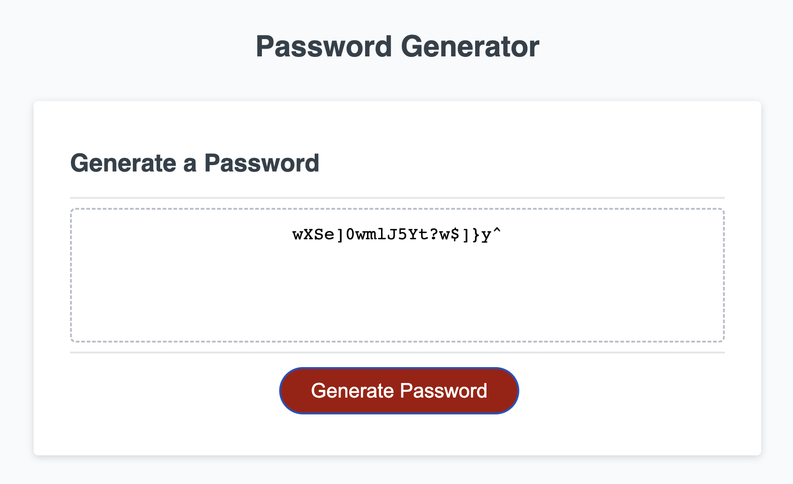
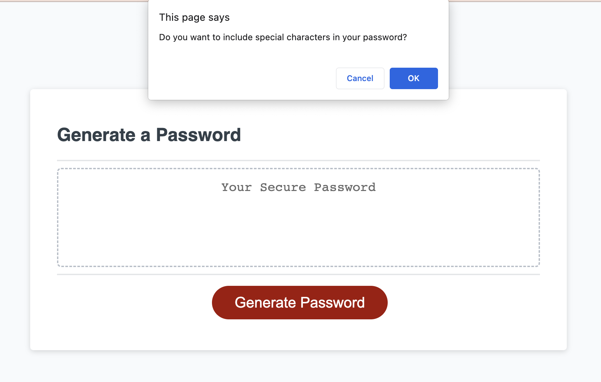

# password-generator

## Description
An app that runs in the browser and is powered by JavaScript code. Allowing an employee to generate a random password based on criteria they've selected.

The criteria for this project:

1. Generate a password when the button is clicked
2. Present a series of prompts for the password criteria:
    - Length of password: at least 10 characters but no more than 64
    - Whether the user wants to include: Lowercase, uppercase, numeric or special characters
3. Code should validate for each input and at least one character type should be selected
4. Once all prompt are answered the password should be generated and displayed to the page.

To visit the website, [please click this link.](https://bethanyryalls.github.io/password-generator/)

## Table of Contents
- [Description](#description)
- [Installation/Usage](#installationusage)
- [Resources](#resources)
- [License](#license)

## Installation/Usage

### Screenshot
The following screenshot shows an example of the prompts and the final generated password
    
    

### Users
To visit the website, [please click this link.](https://bethanyryalls.github.io/password-generator/)

You will be directed to the webpage where you can press the 'Generate Password' button and will be asked a series of questions, give your answers and a password will be generated based on your requirements.

### Developers
Navigate to the main page of the repository
Click the green 'Code' button and copy the SSH or HTTPS key
In terminal (Mac) or Git Bash (Windows) clone into the directory you want the repo in using the 'git clone' command followed by pasting your SSH or HTTPS key
Open the directory in your code editor
Inspect the index.html file and index.js file, you can change the character sets, add new conditions etc

## Resources
- [Stack Overflow](https://stackoverflow.com)

## License

